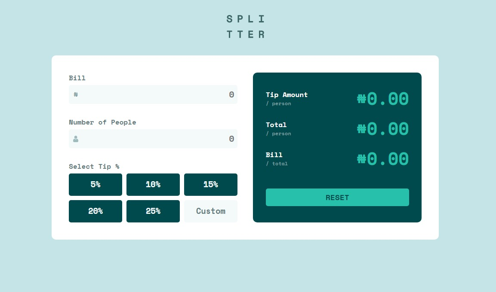
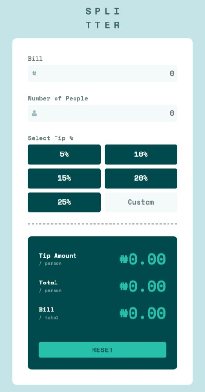

## Tip calculator app
This is a solution to the [Tip calculator app challenge on Frontend Mentor](https://www.frontendmentor.io/challenges/tip-calculator-app-ugJNGbJUX).

## Table of contents

- [Screenshot](#screenshot)
- [Links](#links)
- [Built with](#built-with)

### Screenshot

### Links
- Live Site URL: [https://charlzx.github.io/tip_calculator](https://charlzx.github.io/tip_calculator)

### Built with
- Semantic HTML5 markup
- CSS custom properties
- CSS Grid
- Mobile-first workflow
- Javascript
